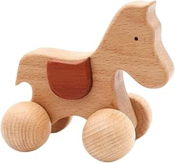

# GenAIMarketing :sparkles::star::star2:

# Definición del tema : :mega::mega::rocket::rocket: Contenido para campañas de marketing para juguetes de madera a través de ChatGPT :robot: y Prompt engineering :rocket::rocket::mega::mega:

## Contenido general

[Páginas web con contenido relevante para el proyecto](paginas_web.md) :dart:

[Resumen generado a partir de prompt engineering](resumen_web.md):page_facing_up:

## Generación de contenido para campañas de marketing para juguetes de madera

[Campaña en Search](search.md):mag_right:

[Campaña de Youtube](youtube.md):diamonds:

[Campaña en Instagram](instagram.md):tv:

## Presentación :eyes:
[Presentación del Challenge](S05_Challenge_Checkpoint.pdf)

## Equipo 27 GenAIMarketing
- :smiley: Adolfo Castro
- :smiley: Cris Brito
- :smiley: Mónica Valencia
- :smiley: Pablo Sotres
