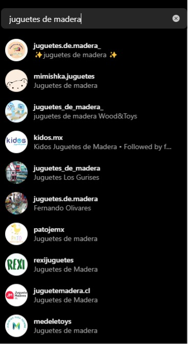
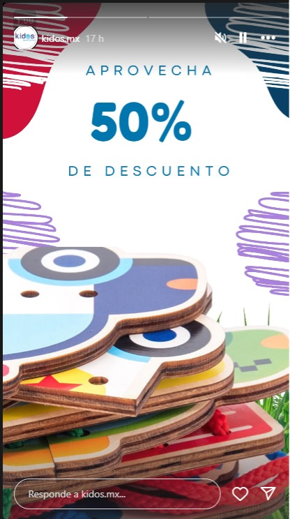
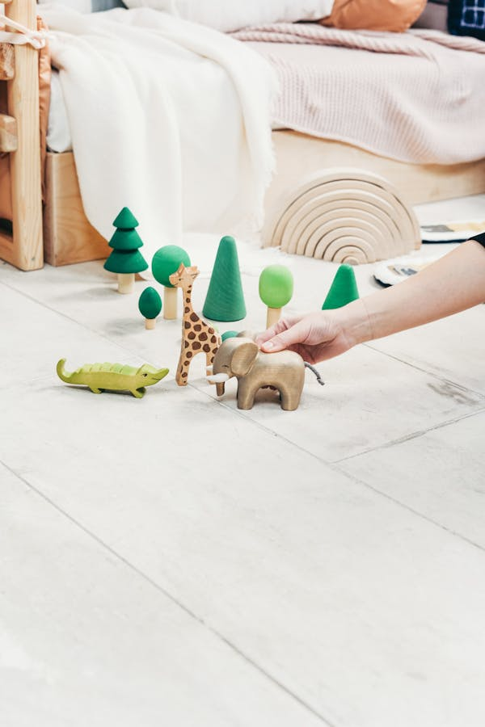

[Inicio](README.md)
# :star2:Campañas propuestas: Marketing para Instagram:star2:

- [Objetivo](#objetivo)
- [Puntos clave](#Puntos-clave)
- [Estrategia](#Estrategia)
- [Ejemplo de contenido](#Ejemplo-de-contenido)
- [Revisiones](#Revisiones)
- [Fact Checking](#Fact-Checking)
- [Imágenes](#Imágenes)

:dart:
## Objetivo
Crear una comunidad de padres y educadores interesados en juguetes educativos y sostenibles, y fomentar la participación activa.

:bookmark:
## Puntos clave
- **Crear Comunidad:** Fomentar una comunidad activa de padres y educadores interesados en juguetes educativos y sostenibles.
- **Posicionamiento de Marca:** Aumentar el reconocimiento de la marca a través de contenido visual atractivo.
- **Engagement y Participación:** Incrementar la participación del usuario mediante contenido generado por ellos mismos, concursos y sorteos.

## Estrategia
- **Feed Visualmente Atractivo:** Publicar fotos de alta calidad de los juguetes en uso, destacando su diseño y funcionalidad.
- **Historias y Reels:** Compartir historias diarias y reels mostrando el día a día con los juguetes de madera, actividades y eventos especiales.
- **Contenido Generado por Usuarios:** Animar a los clientes a compartir fotos y videos de sus hijos jugando con los juguetes de madera utilizando un hashtag específico.

## Ejemplo de contenido
:point_up:
- **Publicación de Producto:** "Nuestros bloques de construcción de madera no solo son divertidos, sino también educativos. 🌟 #JuguetesDeMadera #Aprendizaje"
- **Historia:** "¡Hoy en nuestras historias! Mira cómo los niños disfrutan construyendo con nuestros juguetes de madera. 🧩✨"
- **Reel:** "De la caja al juego: cómo nuestros juguetes de madera inspiran creatividad en cada paso. 🎨🧸"
- **CGU:** "Comparte tus momentos con nuestros juguetes de madera y usa el hashtag #JuguetesEducativos para tener la oportunidad de aparecer en nuestra página."
Resultados campañas

## Revisiones
Las secciones anteriores fueron revisadas, modificadas y ajustadas con ChatGPT para reescribir secciones, donde se ajustó el tono y formato.

## Fact Checking
Las secciones anteriores fueron verificadas y revisadas para evitar información alucinada o incorrecta.

## Imágenes
Imágenes libres de derechos (royalty-free) para el contenido de la campaña.

| Refernecia    | Sitio Web |
| -------- | ------- |
| Imagen1    | https://images.pexels.com/photos/255514/pexels-photo-255514.jpeg?auto=compress&cs=tinysrgb&w=1260&h=750&dpr=1     |
| Imagen2     | https://images.pexels.com/photos/3661195/pexels-photo-3661195.jpeg?auto=compress&cs=tinysrgb&w=600     |

[Inicio](README.md)
