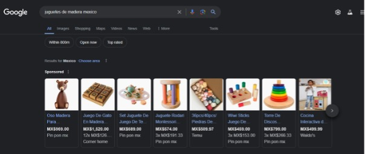

[Inicio](README.md) \[[Campaña en Search](search.md)\] \[[Campaña de Youtube](youtube.md) \[[Campaña en Instagram](instagram.md)

# :star2:Campañas propuestas: Marketing para Search (SEO y SEM):star2:

- [Objetivo](#objetivo)
- [Estrategia SEO Search Engine Optimization](#Estrategia-SEO-Search-Engine-Optimization)
- [Estrategia SEM Search Engine Marketing](#Estrategia-SEM-Search-Engine-Marketing)
- [Ejemplo](#ejemplo)
- [Revisiones](#Revisiones)
- [Fact Checking](#Fact-Checking)
- [Imágenes](#Imágenes)

:dart:
## Objetivo
Aumentar la visibilidad de la marca y las ventas de juguetes de madera a través de estrategias de optimización en motores de búsqueda (SEO) y marketing en motores de búsqueda (SEM).

:bookmark:
## Estrategia SEO Search Engine Optimization
- **Investigación de Palabras Clave:**
  - Identificar palabras clave relacionadas con juguetes de madera, educación infantil, sostenibilidad y desarrollo infantil.
  - Utilizar herramientas como Google Keyword Planner, Ahrefs, o SEMrush para encontrar palabras clave con alto volumen de búsqueda y baja competencia.
- **Optimización On-Page:**
  - Contenido de Calidad: Crear artículos de blog y páginas de producto detalladas que incluyan palabras clave relevantes.
  - Etiquetas Meta: Optimizar títulos, descripciones y encabezados con palabras clave objetivo.
  - Imágenes: Usar nombres de archivo descriptivos y etiquetas ALT optimizadas para imágenes.
- **Optimización Off-Page:**
  - Backlinks: Obtener enlaces de retroceso de sitios web de alta autoridad mediante colaboraciones, guest posting y asociaciones.
  - Redes Sociales: Promocionar contenido en redes sociales para generar tráfico y enlaces.
- **SEO Técnico:**
  - Velocidad del Sitio: Asegurarse de que el sitio web cargue rápidamente en todas las plataformas.
  - Mobile-Friendly: Optimizar el sitio para dispositivos móviles.
  - Mapa del Sitio: Crear y enviar un mapa del sitio a Google Search Console.

:bookmark:
## Estrategia SEM Search Engine Marketing

- **Google Ads:**
  - Anuncios de Búsqueda: Crear anuncios de texto que aparezcan en los resultados de búsqueda cuando los usuarios busquen palabras clave relacionadas con juguetes de madera.
  - Anuncios de Display: Utilizar anuncios gráficos para alcanzar a usuarios en sitios web relacionados con maternidad, educación y sostenibilidad.
- **Campañas de Shopping:**
  - Google Shopping: Configurar anuncios de Shopping para mostrar imágenes, precios y descripciones de productos directamente en los resultados de búsqueda de Google.
- **Remarketing:**
  - Anuncios de Remarketing: Mostrar anuncios a usuarios que hayan visitado previamente el sitio web pero no hayan realizado una compra, recordándoles los productos que vieron.

## Ejemplo
:point_up:
- **Investigación de Palabras Clave:**
  - Palabras clave seleccionadas: "juguetes de madera educativos", "juguetes sostenibles para niños", "beneficios de los juguetes de madera".
- **Optimización On-Page:**
  - Artículo de blog: "5 Beneficios de los Juguetes de Madera para el Desarrollo Infantil".
  - Página de producto: "Bloques de Construcción de Madera - Juguete Educativo y Ecológico".
- **Google Ads:**
  - Anuncio de Búsqueda:
    - Título: "Compra Juguetes de Madera Educativos - Calidad y Sostenibilidad"
    - Descripción: "Descubre nuestra colección de juguetes de madera. Ecológicos, educativos y duraderos. ¡Compra ahora y recibe un 10% de descuento!"
  - Anuncio de Display:
    - Imagen: Niños jugando con juguetes de madera.
    - Texto: "Juguetes de madera educativos para un aprendizaje divertido y sostenible. ¡Compra ahora!"
- **Remarketing:**
  - Anuncio: "¿Aún pensando en nuestros juguetes de madera? ¡Vuelve y obtén un 15% de descuento en tu compra!"

Identificamos que los principales que aparecen en las campañas de search en Google son productos de Shopping de Pin Pon, corner home Temu y Waldo’s.

## Revisiones
Las secciones anteriores fueron revisadas, modificadas y ajustadas con ChatGPT para reescribir secciones, donde se ajustó el tono y formato

## Fact Checking
Las secciones anteriores fueron verificadas y revisadas para evitar información alucinada o incorrecta.

## Imágenes
Imágenes libres de derechos (royalty-free) para el contenido de la campaña.

| Refernecia    | Sitio Web |
| -------- | ------- |
| Imagen1    | https://images.pexels.com/photos/3933025/pexels-photo-3933025.jpeg?auto=compress&cs=tinysrgb&w=600    |

[Inicio](README.md)
