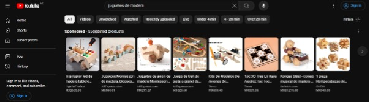
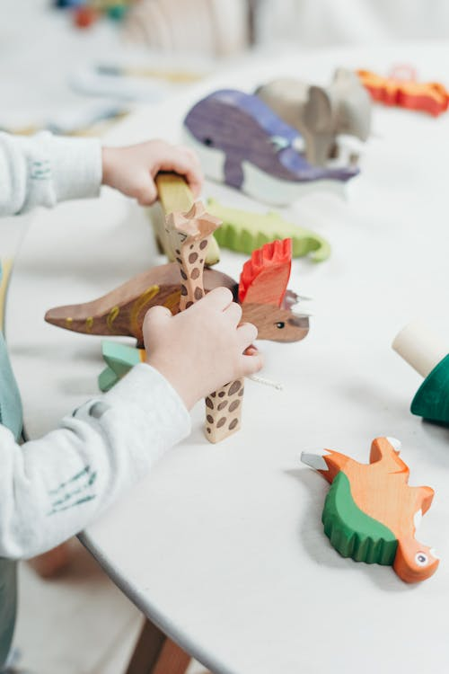
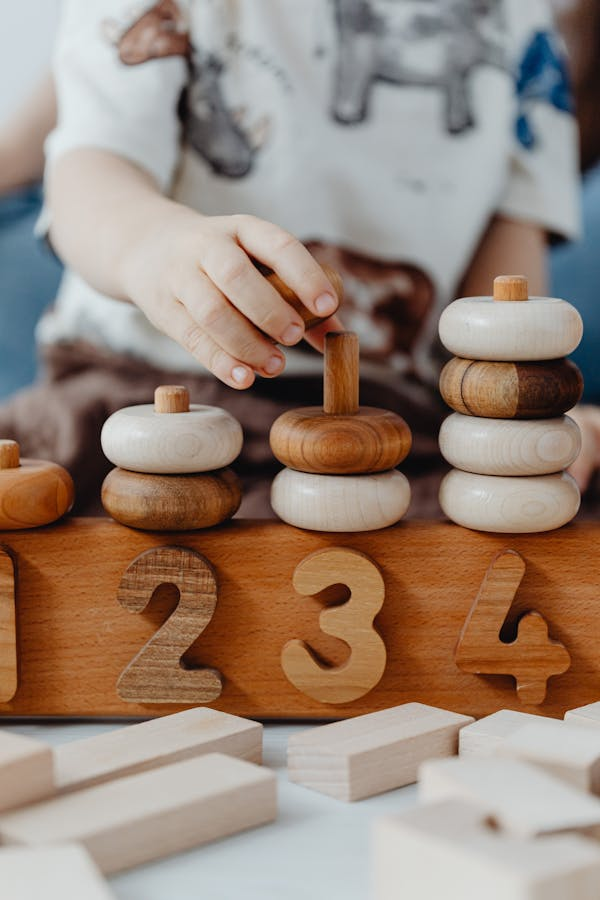

[Inicio](README.md)
# :star2:Campañas propuestas: Marketing para YouTube:star2:

- [Objetivo](#objetivo)
- [Puntos clave](#Puntos-clave)
- [Estrategia](#Estrategia)
- [Ejemplo de contenido](#Ejemplo-de-contenido)
- [Revisiones](#Revisiones)
- [Fact Checking](#Fact-Checking)
- [Imágenes](#Imágenes)

:dart:
## Objetivo
Mostrar el uso de los juguetes en situaciones reales y educativas, aumentando la visibilidad de la marca.

:bookmark:
## Puntos clave
- **Posicionamiento de Marca:** Establecer a la marca como líder en juguetes educativos y sostenibles.
- **Educación del Cliente:** Mostrar cómo los juguetes de madera pueden ser utilizados para el aprendizaje y desarrollo de los niños.
- **Engagement:** Aumentar la interacción con el contenido a través de tutoriales y colaboraciones.

## Estrategia

- **Tutoriales y Demostraciones:** Crear una serie de videotutoriales y demostrativos sobre cómo utilizar los juguetes de madera para actividades educativas.
- **Testimonios y Unboxings:** Publicar videos de unboxings y testimonios de padres, maestros e influencers.
- **Colaboraciones:** Colaborar con YouTubers e influencers enfocados en maternidad, educación y sostenibilidad para ampliar el alcance.

## Ejemplo de contenido
- **Tutorial:** "Cómo usar juguetes de madera para enseñar matemáticas a los niños. Mira nuestras actividades paso a paso."
- **Unboxing:** "Descubre nuestros nuevos juguetes de madera con este unboxing. Calidad y diversión garantizadas."
- **Colaboración:** "Hoy, colaboramos con [Nombre del Influencer] para mostrar cómo nuestros juguetes de madera pueden hacer que el aprendizaje sea divertido y sostenible."
Identificamos que las campañas de Youtube están centradas en anuncios patrocinados de Light in Box Ali Express , Temu y Farfetch, incluyendo productos de Shopping. 

Y contenido de creadores relacionados a la cultura DIY. 

## Revisiones
Las secciones anteriores fueron revisadas, modificadas y ajustadas con ChatGPT para reescribir secciones, donde se ajustó el tono y formato.

## Fact Checking
Las secciones anteriores fueron verificadas y revisadas para evitar información alucinada o incorrecta.

## Imágenes
Imágenes libres de derechos (royalty-free) para el contenido de la campaña.

| Refernecia    | Sitio Web |
| -------- | ------- |
| Imagen1    | https://images.pexels.com/photos/3661264/pexels-photo-3661264.jpeg?auto=compress&cs=tinysrgb&w=1260&h=750&dpr=1    |
| Imagen2     | https://images.pexels.com/photos/7269671/pexels-photo-7269671.jpeg?auto=compress&cs=tinysrgb&w=600      |

[Inicio](README.md)
